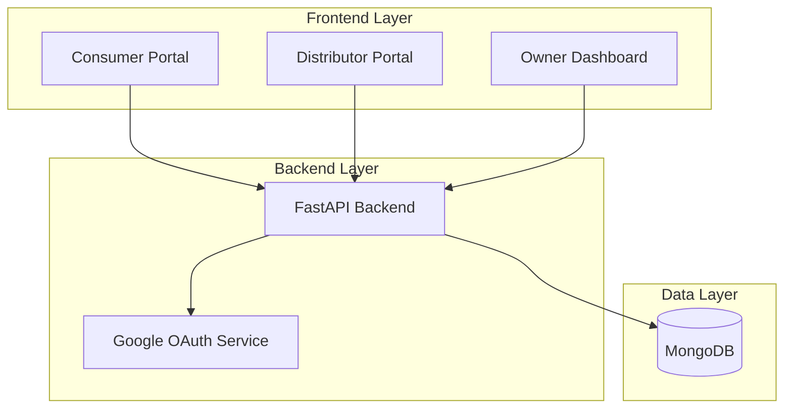

# Design Document - Indostar E-commerce Application

## Overview

The Indostar E-commerce Application is a full-stack web application built with a Python backend (FastAPI), TypeScript frontend (React), and MongoDB database. The system implements role-based access control with three distinct user interfaces: Consumer Portal, Distributor Portal, and Owner Dashboard. Google OAuth provides authentication, and the architecture supports scalability for future enhancements including Razorpay payment integration.

## Architecture

### High-Level Architecture



### Technology Stack

**Frontend:**
- React 18+ with TypeScript
- React Router for navigation
- Axios for API communication
- CSS3 for animations and styling
- Context API for state management

**Backend:**
- Python 3.10+
- FastAPI framework
- Pydantic for data validation
- Motor (async MongoDB driver)
- Google OAuth2 library
- JWT for session management

**Database:**
- MongoDB 6.0+
- Collections: users, products, orders, inventory

**Deployment:**
- Docker containers
- Environment-based configuration
- CORS middleware for cross-origin requests

## Components and Interfaces

### Frontend Components

#### 1. Authentication Module

**LoginPage Component**
- Displays company branding and login options
- Two authentication paths: "Login as Customer" and "Login as Owner/Distributor"
- Google OAuth button integration
- Redirects to appropriate portal based on user role

**AuthContext**
- Manages authentication state
- Stores JWT tokens in localStorage
- Provides user role and profile information
- Handles token refresh and logout

#### 2. Consumer Portal Components

**HomePage Component**
- Hero section with attractive visuals and company mission
- Featured products carousel
- Category navigation cards (Jaggery, Oil, Chutney Powder, Pickles, Milk)
- CSS animations for scroll effects and hover states

**ProductCatalog Component**
- Grid layout of products with images
- Filter by category
- Search functionality
- Product cards with hover animations

**ProductDetail Component**
- Detailed product information
- Nutritional facts
- Add to cart functionality
- Quantity selector
- Delivery availability indicator

**Cart Component**
- List of selected products
- Quantity adjustment
- Price calculation with taxes
- Delivery address form
- Order summary

**OrderHistory Component**
- List of past orders
- Order status tracking
- Order details view

#### 3. Distributor Portal Components

**DistributorDashboard Component**
- Bulk product catalog
- Wholesale pricing display
- Quick order functionality

**BulkOrderForm Component**
- Product selection with bulk units
- Quantity input for large orders
- Inter-state delivery options
- Shipping cost calculator
- Order confirmation

**DistributorOrderHistory Component**
- Order tracking with status updates
- Reorder functionality
- Invoice download

#### 4. Owner Dashboard Components

**InventoryManagement Component**
- Product list with current stock levels
- Low-stock alerts
- Inventory update forms
- Bulk inventory import

**OrderManagement Component**
- All orders view (consumer + distributor)
- Order status management
- Order fulfillment workflow

**Analytics Component**
- Sales charts and trends
- Popular products
- Revenue metrics
- Category performance

### Backend API Endpoints

#### Authentication Endpoints

```
POST /api/auth/google
- Initiates Google OAuth flow
- Returns authorization URL

POST /api/auth/callback
- Handles OAuth callback
- Creates/updates user record
- Returns JWT token and user role

POST /api/auth/refresh
- Refreshes JWT token
- Returns new token

POST /api/auth/logout
- Invalidates session
```

#### Product Endpoints

```
GET /api/products
- Query params: category, search, limit, offset
- Returns paginated product list

GET /api/products/{product_id}
- Returns detailed product information

POST /api/products (Owner only)
- Creates new product
- Request body: product details

PUT /api/products/{product_id} (Owner only)
- Updates product information

DELETE /api/products/{product_id} (Owner only)
- Soft deletes product
```

#### Order Endpoints

```
POST /api/orders
- Creates new order
- Request body: cart items, delivery address, user info
- Returns order ID

GET /api/orders
- Returns user's order history
- Owner sees all orders

GET /api/orders/{order_id}
- Returns order details

PUT /api/orders/{order_id}/status (Owner only)
- Updates order status
```

#### Inventory Endpoints

```
GET /api/inventory (Owner only)
- Returns all inventory levels

PUT /api/inventory/{product_id} (Owner only)
- Updates inventory quantity
- Request body: quantity, operation (set/add/subtract)

GET /api/inventory/alerts (Owner only)
- Returns low-stock products
```

#### User Endpoints

```
GET /api/users/profile
- Returns current user profile

PUT /api/users/profile
- Updates user profile
- Request body: name, phone, addresses
```

## Data Models

### User Collection

```typescript
interface User {
  _id: ObjectId;
  googleId: string;
  email: string;
  name: string;
  role: 'consumer' | 'distributor' | 'owner';
  phone?: string;
  addresses?: Address[];
  createdAt: Date;
  updatedAt: Date;
}

interface Address {
  type: 'billing' | 'shipping';
  street: string;
  city: string;
  state: string;
  pincode: string;
  isDefault: boolean;
}
```

### Product Collection

```typescript
interface Product {
  _id: ObjectId;
  name: string;
  category: 'jaggery' | 'oil' | 'chutney_powder' | 'pickles' | 'milk';
  description: string;
  images: string[];
  price: {
    consumer: number;
    distributor: number;
  };
  unit: string;
  nutritionalInfo?: NutritionalInfo;
  interStateDelivery: boolean;
  isActive: boolean;
  createdAt: Date;
  updatedAt: Date;
}

interface NutritionalInfo {
  calories: number;
  protein: number;
  carbohydrates: number;
  fat: number;
  [key: string]: number;
}
```

### Inventory Collection

```typescript
interface Inventory {
  _id: ObjectId;
  productId: ObjectId;
  quantity: number;
  unit: string;
  lowStockThreshold: number;
  lastRestocked: Date;
  updatedAt: Date;
}
```

### Order Collection

```typescript
interface Order {
  _id: ObjectId;
  orderNumber: string;
  userId: ObjectId;
  userType: 'consumer' | 'distributor';
  items: OrderItem[];
  subtotal: number;
  tax: number;
  shippingCost: number;
  total: number;
  deliveryAddress: Address;
  status: 'pending' | 'confirmed' | 'processing' | 'shipped' | 'delivered' | 'cancelled';
  paymentStatus: 'pending' | 'completed' | 'failed';
  paymentMethod?: string;
  notes?: string;
  createdAt: Date;
  updatedAt: Date;
}

interface OrderItem {
  productId: ObjectId;
  productName: string;
  quantity: number;
  unit: string;
  pricePerUnit: number;
  total: number;
}
```

## Error Handling

### Frontend Error Handling

1. **API Error Interceptor**
   - Catches all API errors
   - Displays user-friendly error messages
   - Handles 401 (unauthorized) by redirecting to login
   - Handles 403 (forbidden) by showing access denied message

2. **Form Validation**
   - Client-side validation before API calls
   - Real-time validation feedback
   - Error messages below form fields

3. **Network Error Handling**
   - Retry mechanism for failed requests
   - Offline detection
   - Loading states during API calls

### Backend Error Handling

1. **Exception Handlers**
   - Custom exception classes for different error types
   - Global exception handler in FastAPI
   - Structured error responses with error codes

2. **Validation Errors**
   - Pydantic model validation
   - Custom validators for business logic
   - Detailed validation error messages

3. **Database Errors**
   - Connection error handling
   - Transaction rollback on failures
   - Duplicate key error handling

4. **Authentication Errors**
   - Invalid token handling
   - Expired token handling
   - Insufficient permissions handling

### Error Response Format

```typescript
interface ErrorResponse {
  error: {
    code: string;
    message: string;
    details?: any;
  };
  timestamp: string;
}
```

## Testing Strategy

### Frontend Testing

1. **Unit Tests**
   - Component rendering tests
   - Utility function tests
   - State management tests
   - Use Jest and React Testing Library

2. **Integration Tests**
   - API integration tests with mock server
   - User flow tests
   - Form submission tests

3. **E2E Tests**
   - Critical user journeys
   - Authentication flows
   - Order placement flows

### Backend Testing

1. **Unit Tests**
   - Service layer tests
   - Utility function tests
   - Data validation tests
   - Use pytest

2. **Integration Tests**
   - API endpoint tests
   - Database operation tests
   - Authentication flow tests

3. **Load Tests**
   - Concurrent user simulation
   - Database query performance
   - API response time benchmarks

### Test Data

- Seed data for development environment
- Mock data for frontend development
- Test fixtures for automated tests

## Security Considerations

1. **Authentication & Authorization**
   - JWT tokens with short expiration
   - Refresh token mechanism
   - Role-based access control on all endpoints
   - Secure cookie storage for tokens

2. **Data Protection**
   - Input sanitization
   - SQL injection prevention (N/A for MongoDB, but NoSQL injection prevention)
   - XSS prevention
   - CSRF protection

3. **API Security**
   - Rate limiting
   - CORS configuration
   - HTTPS enforcement in production
   - API key validation for sensitive operations

4. **Database Security**
   - MongoDB authentication
   - Connection string encryption
   - Principle of least privilege for database users

## Deployment Architecture

### Development Environment

```
Frontend: http://localhost:3000
Backend: http://localhost:8000
MongoDB: mongodb://localhost:27017
```

### Production Environment

```
Frontend: Served via Nginx or CDN
Backend: Gunicorn + Uvicorn workers
MongoDB: MongoDB Atlas or self-hosted cluster
```

### Docker Configuration

**Frontend Dockerfile**
- Multi-stage build
- Node.js for build
- Nginx for serving static files

**Backend Dockerfile**
- Python base image
- Install dependencies
- Run with Gunicorn

**Docker Compose**
- Frontend service
- Backend service
- MongoDB service
- Network configuration

### Environment Variables

**Frontend (.env)**
```
REACT_APP_API_URL=http://localhost:8000
REACT_APP_GOOGLE_CLIENT_ID=<client_id>
```

**Backend (.env)**
```
MONGODB_URL=mongodb://localhost:27017
DATABASE_NAME=indostar
JWT_SECRET=<secret_key>
GOOGLE_CLIENT_ID=<client_id>
GOOGLE_CLIENT_SECRET=<client_secret>
CORS_ORIGINS=http://localhost:3000
```

## CSS Animation Guidelines

1. **Page Transitions**
   - Fade-in animations for page loads (300ms)
   - Slide transitions for navigation (250ms)

2. **Interactive Elements**
   - Hover scale effects on buttons (200ms)
   - Color transitions on hover (150ms)
   - Shadow animations for depth (200ms)

3. **Loading States**
   - Skeleton screens for content loading
   - Spinner animations for actions
   - Progress bars for multi-step processes

4. **Scroll Animations**
   - Fade-in on scroll for product cards
   - Parallax effects for hero sections
   - Smooth scroll behavior

5. **Performance**
   - Use CSS transforms for animations
   - Avoid animating layout properties
   - Use will-change for complex animations
   - Respect prefers-reduced-motion

## Future Enhancements (Version 2)

1. **Razorpay Integration**
   - Payment gateway setup
   - Order payment flow
   - Payment status webhooks
   - Refund handling

2. **Additional Features**
   - Product reviews and ratings
   - Wishlist functionality
   - Email notifications
   - SMS notifications for order updates
   - Advanced analytics dashboard
   - Promotional codes and discounts
